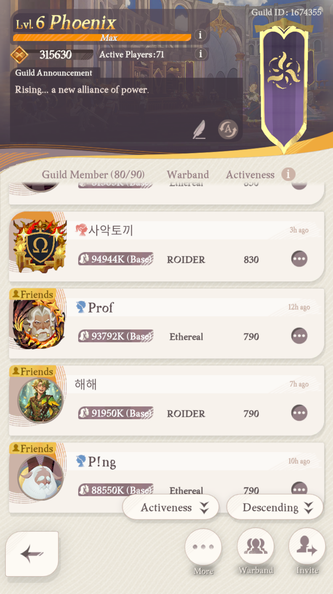
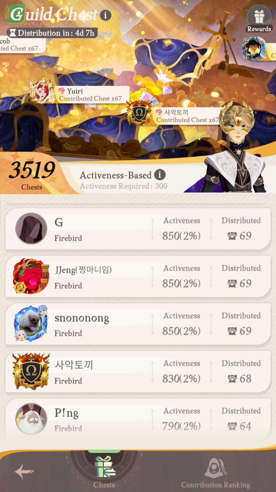
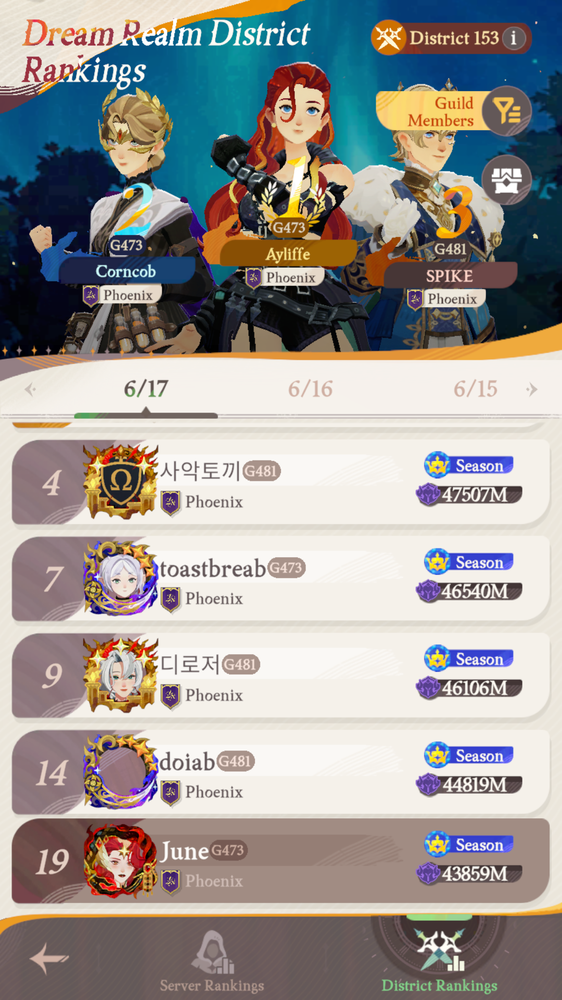
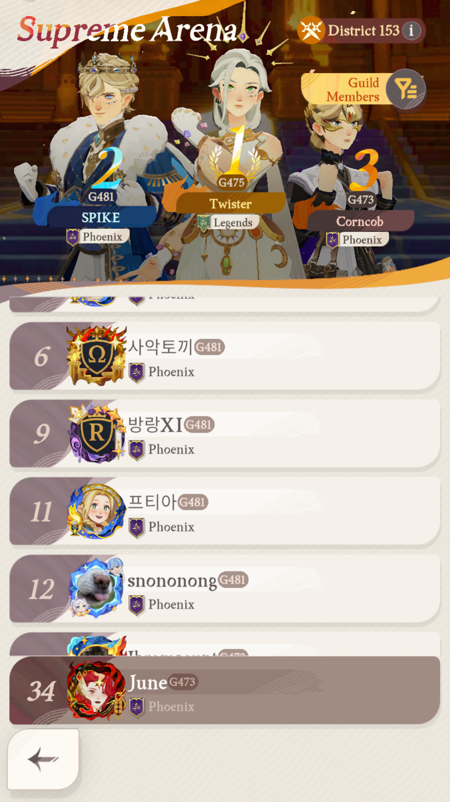

# OCR Hangul Issues

This note documents the current Korean/Hangul OCR failure modes in the app so we can fix them methodically.

## Scope

These notes are mainly about the AFK Journey guild/member scanning flow when `Use Qwen2-VL (GPU)` is enabled.

Relevant files:

- [src-tauri/src-python/adb_auto_player/ocr/qwen2vl_backend.py](/E:/Pycharm%20Projects/AFKJGuildManagement/src-tauri/src-python/adb_auto_player/ocr/qwen2vl_backend.py:232)
- [src-tauri/src-python/adb_auto_player/games/afk_journey/mixins/guild_member_scan.py](/E:/Pycharm%20Projects/AFKJGuildManagement/src-tauri/src-python/adb_auto_player/games/afk_journey/mixins/guild_member_scan.py:160)

## Implementation Status

As of 2026-06-18, the first three small patches described below have landed:

- PR1: Qwen parse-rejection logging plus `_ocr_debug.backend_used`
- PR2: rankings supplemental recovery now uses `_find_best_member_match()`
- PR3: full-frame structured Qwen passes now override the width cap to `1080`

Still pending from those items:

- live performance validation for PR3 on real frames / VRAM-constrained GPUs
- per-resolved-name backend attribution for the effectiveness harness

## Important Clarification

Tesseract is not the only OCR backend in this app.

- Tesseract is still used in some modules, for example:
  - [src-tauri/src-python/adb_auto_player/games/blue_protocol_star_resonance/blue_protocol_star_resonance.py](/E:/Pycharm%20Projects/AFKJGuildManagement/src-tauri/src-python/adb_auto_player/games/blue_protocol_star_resonance/blue_protocol_star_resonance.py:111)
  - [src-tauri/src-python/adb_auto_player/games/afk_journey/mixins/homestead_helper.py](/E:/Pycharm%20Projects/AFKJGuildManagement/src-tauri/src-python/adb_auto_player/games/afk_journey/mixins/homestead_helper.py:231)
- AFK Journey popup OCR is configurable and defaults to Tesseract unless the setting is changed:
  - [src-tauri/src-python/adb_auto_player/games/afk_journey/popup_message_handler.py](/E:/Pycharm%20Projects/AFKJGuildManagement/src-tauri/src-python/adb_auto_player/games/afk_journey/popup_message_handler.py:332)
- Guild/member scanning does not use Tesseract as its primary OCR path:
  - default primary is RapidOCR
  - optional primary is Qwen2-VL with RapidOCR fallback
  - [src-tauri/src-python/adb_auto_player/games/afk_journey/mixins/guild_member_scan.py](/E:/Pycharm%20Projects/AFKJGuildManagement/src-tauri/src-python/adb_auto_player/games/afk_journey/mixins/guild_member_scan.py:160)

## Observed Failure Modes

### 1. Qwen does not own bounding-box detection

Qwen2-VL is used for text extraction, but not for text block detection.

- `QwenVLOCRBackend.detect_text_blocks()` delegates to RapidOCR:
  - [src-tauri/src-python/adb_auto_player/ocr/qwen2vl_backend.py](/E:/Pycharm%20Projects/AFKJGuildManagement/src-tauri/src-python/adb_auto_player/ocr/qwen2vl_backend.py:510)

Implication:

- If RapidOCR misses a Hangul row, splits a row badly, or groups blocks incorrectly, Qwen may never get a clean crop to read.
- Some apparent "Qwen Hangul failures" may actually be upstream layout failures from RapidOCR.

Two distinct failure cases hide under "RapidOCR controls discovery", and only one is recoverable:

- **Misread row** (box detected, text wrong): recoverable. Rankings recovery iterates `bbox_debug` rows whose name isn't in `guild_set` and re-reads the crop with Qwen — the row only needs to be *detected*, not read correctly.
  - [guild_member_scan.py](/E:/Pycharm%20Projects/AFKJGuildManagement/src-tauri/src-python/adb_auto_player/games/afk_journey/mixins/guild_member_scan.py:1589)
- **Missing box** (no detection at all): unrecoverable. If RapidOCR never emits a block for the row, there is nothing for Qwen recovery to iterate over.

When triaging a missing member, first determine which case it is — they need different fixes (crop/threshold tuning vs. forcing Qwen full-frame extraction).

### 2. Qwen is only a partial recovery path in some flows

Rankings, activeness, and chest flows do not use Qwen in the same way.

- Rankings:
  - full-screen structured extraction through Qwen
  - plus targeted Qwen row-crop recovery for suspicious supplemental rows
  - [guild_member_scan.py](/E:/Pycharm%20Projects/AFKJGuildManagement/src-tauri/src-python/adb_auto_player/games/afk_journey/mixins/guild_member_scan.py:1368)
  - [guild_member_scan.py](/E:/Pycharm%20Projects/AFKJGuildManagement/src-tauri/src-python/adb_auto_player/games/afk_journey/mixins/guild_member_scan.py:1578)
- Activeness:
  - Qwen is only asked to recover rows where a numeric activeness block exists but no name was paired
  - [guild_member_scan.py](/E:/Pycharm%20Projects/AFKJGuildManagement/src-tauri/src-python/adb_auto_player/games/afk_journey/mixins/guild_member_scan.py:2053)
- Chest:
  - Qwen only supplements missing pairs after RapidOCR parsing
  - [guild_member_scan.py](/E:/Pycharm%20Projects/AFKJGuildManagement/src-tauri/src-python/adb_auto_player/games/afk_journey/mixins/guild_member_scan.py:2179)

Implication:

- If RapidOCR produces a wrong but plausible name for a Hangul member, Qwen often does not get a chance to correct it.
- Recovery is stronger for rankings than for activeness/chest.

### 3. Structured-output brittleness can still trigger fallback

Several Qwen methods require strict JSON output.

- `extract_activeness_from_screenshot()`
- `extract_chest_from_screenshot()`
- `extract_rankings_from_screenshot()`

Relevant code:

- [src-tauri/src-python/adb_auto_player/ocr/qwen2vl_backend.py](/E:/Pycharm%20Projects/AFKJGuildManagement/src-tauri/src-python/adb_auto_player/ocr/qwen2vl_backend.py:245)
- [src-tauri/src-python/adb_auto_player/ocr/qwen2vl_backend.py](/E:/Pycharm%20Projects/AFKJGuildManagement/src-tauri/src-python/adb_auto_player/ocr/qwen2vl_backend.py:308)
- [src-tauri/src-python/adb_auto_player/ocr/qwen2vl_backend.py](/E:/Pycharm%20Projects/AFKJGuildManagement/src-tauri/src-python/adb_auto_player/ocr/qwen2vl_backend.py:370)

If the response is empty, malformed, or not parseable as the expected JSON array, the method returns `None` and now logs the rejection reason in debug output.

Then rankings code falls back to RapidOCR for that frame:

- [guild_member_scan.py](/E:/Pycharm%20Projects/AFKJGuildManagement/src-tauri/src-python/adb_auto_player/games/afk_journey/mixins/guild_member_scan.py:1477)

Implication:

- A frame can still end up using RapidOCR because the LLM response format was rejected, but that fallback is now visible in debug logs.
- This can inflate apparent Hangul failure rates.

### 4. Name crops are noisy even before resizing

Some Qwen recovery crops include more than the target name row.

Examples:

- Rankings supplemental recovery crops a horizontal slice from rank boundary to score boundary:
  - [guild_member_scan.py](/E:/Pycharm%20Projects/AFKJGuildManagement/src-tauri/src-python/adb_auto_player/games/afk_journey/mixins/guild_member_scan.py:1604)
- Activeness orphan recovery crops a tall `+-120px` band and the full left column:
  - [guild_member_scan.py](/E:/Pycharm%20Projects/AFKJGuildManagement/src-tauri/src-python/adb_auto_player/games/afk_journey/mixins/guild_member_scan.py:2071)

Implication:

- Adjacent rows, guild labels, power text, timestamps, or decoration may contaminate the Qwen prompt.
- This is especially risky for short Hangul names.

### 5. Post-match logic can discard near-correct Hangul reads

There are multiple matching/correction stages after OCR.

- General best-match logic:
  - [guild_member_scan.py](/E:/Pycharm%20Projects/AFKJGuildManagement/src-tauri/src-python/adb_auto_player/games/afk_journey/mixins/guild_member_scan.py:1005)
- Activeness correction:
  - [guild_member_scan.py](/E:/Pycharm%20Projects/AFKJGuildManagement/src-tauri/src-python/adb_auto_player/games/afk_journey/mixins/guild_member_scan.py:2453)
- Single-name correction:
  - [guild_member_scan.py](/E:/Pycharm%20Projects/AFKJGuildManagement/src-tauri/src-python/adb_auto_player/games/afk_journey/mixins/guild_member_scan.py:2484)

There is already Hangul-aware handling in `_find_best_member_match()`:

- [guild_member_scan.py](/E:/Pycharm%20Projects/AFKJGuildManagement/src-tauri/src-python/adb_auto_player/games/afk_journey/mixins/guild_member_scan.py:1013)

Rankings supplemental Qwen recovery now reuses `_find_best_member_match()` with the standard threshold, instead of the old exact-only case-insensitive gate. That closes the obvious Hangul drop-path, but the safety of this relaxation depends on the rankings list already being filtered to Guild Members before recovery runs:

- guild-member filter setup: [guild_member_scan.py](/E:/Pycharm%20Projects/AFKJGuildManagement/src-tauri/src-python/adb_auto_player/games/afk_journey/mixins/guild_member_scan.py:1288)
- fuzzy recovery path: [guild_member_scan.py](/E:/Pycharm%20Projects/AFKJGuildManagement/src-tauri/src-python/adb_auto_player/games/afk_journey/mixins/guild_member_scan.py:1578)

Implication:

- Qwen near-matches are no longer discarded by an exact-only gate in rankings recovery.
- Remaining risk is over-matching within Hangul-heavy rosters, not exact-gate rejection.

### 6. RapidOCR is a known weak point for Korean in this flow

The code already documents this:

- [guild_member_scan.py](/E:/Pycharm%20Projects/AFKJGuildManagement/src-tauri/src-python/adb_auto_player/games/afk_journey/mixins/guild_member_scan.py:1013)

And the selected RapidOCR profile is a PP-OCR setup configured through:

- [src-tauri/src-python/adb_auto_player/ocr/rapidocr_backend.py](/E:/Pycharm%20Projects/AFKJGuildManagement/src-tauri/src-python/adb_auto_player/ocr/rapidocr_backend.py:33)

Implication:

- Even with Qwen enabled, the system still depends heavily on RapidOCR behavior for box discovery and fallback.

### 7. Qwen image downscaling hurts the full-frame passes, not the name crops

Qwen still defaults to `MAX_IMAGE_WIDTH_CAP = 540` in `_prepare_image()`, but the full-frame structured passes now override that cap to `1080`. `extract_player_name()` still uses the default behavior:

- [qwen2vl_backend.py](/E:/Pycharm%20Projects/AFKJGuildManagement/src-tauri/src-python/adb_auto_player/ocr/qwen2vl_backend.py:232)
- `MAX_IMAGE_WIDTH_CAP = 540`: [qwen2vl_backend.py](/E:/Pycharm%20Projects/AFKJGuildManagement/src-tauri/src-python/adb_auto_player/ocr/qwen2vl_backend.py:30)

The cap matters very differently depending on the call site, so "raise the cap" must be targeted:

- **Full-screen structured passes** (`extract_activeness_from_screenshot`, `extract_chest_from_screenshot`, `extract_rankings_from_screenshot`) now pass `1080`, so normal device-width frames are no longer halved to `540`. This was the high-value loss point because it hit the **primary** extraction path.
- **Rankings name recovery** (`extract_player_name`) crops `_X_RANK_BOUNDARY:_X_SCORE_BOUNDARY` = `200:700` = **500px wide** — already below the 540 cap, so it is **never resized**. Raising the cap does nothing here.
  - crop width: [guild_member_scan.py](/E:/Pycharm%20Projects/AFKJGuildManagement/src-tauri/src-python/adb_auto_player/games/afk_journey/mixins/guild_member_scan.py:1608)
  - boundaries `_X_RANK_BOUNDARY = 200`, `_X_SCORE_BOUNDARY = 700`: [guild_member_scan.py](/E:/Pycharm%20Projects/AFKJGuildManagement/src-tauri/src-python/adb_auto_player/games/afk_journey/mixins/guild_member_scan.py:75)

Implication:

- The targeted full-frame cap change is implemented; live VRAM/latency validation is still pending.

### 8. Prompt examples are not corrupted in source

The Korean examples in the Qwen prompts are stored correctly in UTF-8 source.

Relevant locations:

- [qwen2vl_backend.py](/E:/Pycharm%20Projects/AFKJGuildManagement/src-tauri/src-python/adb_auto_player/ocr/qwen2vl_backend.py:265)
- [qwen2vl_backend.py](/E:/Pycharm%20Projects/AFKJGuildManagement/src-tauri/src-python/adb_auto_player/ocr/qwen2vl_backend.py:461)

Implication:

- Prompt mojibake does not appear to be the source of Hangul failures.

## Most Likely Root Causes

If Hangul accuracy feels too weak with Qwen enabled, the most likely causes are:

1. RapidOCR is still controlling block/row discovery and sometimes hands Qwen bad crops.
2. Qwen structured extraction sometimes fails parsing and silently falls back to RapidOCR.
3. Qwen recovery is inconsistent across flows and often only runs for missing names, not suspicious wrong names.
4. Recovery crops contain too much non-name text.
5. Downstream matching can reject near-correct Hangul outputs.

## Fix Backlog

Effort tags: **(S)** ≈ one-liner / low-risk, **(M)** ≈ contained change, **(L)** ≈ new feature.

### High priority

1. **(S)** Done: explicit debug logging now records why structured Qwen output was rejected and when a frame fell back to RapidOCR.
2. **(S)** Done: rankings supplemental recovery now reuses `_find_best_member_match()` instead of the old exact-only gate.
3. **(S)** Done in code: full-frame structured passes now override the width cap to `1080`. Live VRAM/latency validation is still pending. Note: this is *not* needed for `extract_player_name()` recovery crops (already <540) — see §7.
4. **(M)** Tighten row crops for Qwen name recovery so they isolate the player name better (see §4).
5. **(L)** Expand Qwen retry/recovery to suspicious non-guild names in activeness and chest, not just missing names (depends on item Medium-#1 below for a trigger signal).

### Medium priority

1. **(M)** Define and operationalize a "suspicious name" signal, then route matches through a Qwen retry. Candidate triggers:
   - best-match ratio from `_find_best_member_match()` is below the `_GUILD_NAME_CORRECTION_THRESHOLD` (0.65) but above some floor;
   - a Latin/ASCII-only OCR read in a guild whose roster contains Hangul-only members (likely a garbled Hangul name);
   - a CJK read that doesn't equal any CJK guild member (the `is_cjk_misread` condition already computed in `_find_best_member_match`).
2. **(M)** Consider a separate crop strategy for Hangul-heavy guilds.

### Test coverage

1. Add Korean/Hangul fixtures for:
   - rankings
   - guild activeness
   - chest contribution
   - single-row name crops
2. Add regression tests that verify:
   - Qwen parse failures are visible in logs/debug output
   - suspicious names trigger retry
   - near-correct Hangul outputs survive matching/correction

## Suggested First Changes

If we want to make progress quickly without broad refactors, in order:

1. Done: debug markers now show "Qwen parse failed -> RapidOCR fallback" reasons plus per-frame primary backend provenance.
2. Done: rankings Qwen recovery now uses `_find_best_member_match()` instead of the old exact-match acceptance.
3. Done in code: full-frame structured passes now use the higher width cap — **not** `extract_player_name()`, whose recovery crop (500px) was already under the default cap.
4. Extend Qwen recovery to activeness/chest rows with suspicious names (per the trigger signals above), not only missing names.

Re-measure with the item-1 logging in place after each subsequent change.

## Patch Plan

Six small PRs, sequenced so each is independently shippable and the cheap/safe wins land first. PR1 is a hard prerequisite for measuring the rest. Effort tags as in the backlog: **(S)** one-liner/low-risk, **(M)** contained, **(L)** new feature.

### PR1 — Backend provenance + fallback logging (S) — done

Goal: make it visible, per frame, which backend produced the final result and why a Qwen pass was rejected.

- In `qwen2vl_backend.py`, the structured methods return `None` silently on the empty/`no-match`/`json.loads` paths — only the `except` branch logs. Add a `logger.debug` at each early `return None` naming the reason (`"empty response"`, `"no JSON array in output"`, `"JSON decode failed"`):
  - `extract_activeness_from_screenshot`: [qwen2vl_backend.py:284-291](/E:/Pycharm%20Projects/AFKJGuildManagement/src-tauri/src-python/adb_auto_player/ocr/qwen2vl_backend.py:284)
  - `extract_chest_from_screenshot`: [qwen2vl_backend.py:308](/E:/Pycharm%20Projects/AFKJGuildManagement/src-tauri/src-python/adb_auto_player/ocr/qwen2vl_backend.py:308)
  - `extract_rankings_from_screenshot`: [qwen2vl_backend.py:370](/E:/Pycharm%20Projects/AFKJGuildManagement/src-tauri/src-python/adb_auto_player/ocr/qwen2vl_backend.py:370)
- Add a `backend_used` field (`"qwen"` / `"rapidocr"`) to each `_ocr_debug` frame record so provenance survives into saved debug output. The rankings path already logs the fallback line; add the field there and in the activeness/chest debug dicts:
  - rankings fallback log already at [guild_member_scan.py:1477](/E:/Pycharm%20Projects/AFKJGuildManagement/src-tauri/src-python/adb_auto_player/games/afk_journey/mixins/guild_member_scan.py:1477)
  - activeness debug record: [guild_member_scan.py:2047](/E:/Pycharm%20Projects/AFKJGuildManagement/src-tauri/src-python/adb_auto_player/games/afk_journey/mixins/guild_member_scan.py:2047)
- Current semantics: `backend_used` is now the **primary frame parser**. Rankings frames are `qwen` or `rapidocr`; activeness/chest remain `rapidocr` because Qwen only supplements there, with `qwen_supplemented` / `qwen_supplement_count` recorded separately. Per-resolved-name attribution is still pending.
- Validate: run a scan with `_ocr_debug` enabled; confirm each frame reports a backend and any Qwen rejection prints a reason.
- Tests: assert a forced parse-failure (mock Qwen returning malformed JSON) emits the reason log and sets `backend_used == "rapidocr"`.

### PR2 — Fuzzy match in rankings Qwen recovery (S) — done

Goal: stop discarding near-correct Hangul reads at the exact-match gate.

- Replace the exact gate in the rankings recovery helper with `_find_best_member_match()` + the `_GUILD_NAME_CORRECTION_THRESHOLD` (0.65) check:
  - current gate: [guild_member_scan.py:1613-1614](/E:/Pycharm%20Projects/AFKJGuildManagement/src-tauri/src-python/adb_auto_player/games/afk_journey/mixins/guild_member_scan.py:1613)
  - matcher to reuse: [guild_member_scan.py:1005](/E:/Pycharm%20Projects/AFKJGuildManagement/src-tauri/src-python/adb_auto_player/games/afk_journey/mixins/guild_member_scan.py:1005)
- The helper currently receives `guild_set`; thread `cleaned_members` and `suffix_pat` (already used elsewhere by the matcher) into it, or compute `cleaned_members` from the roster at the call site. Keep the `matched not in recovered_set` dedup.
- Validate: a frame where Qwen reads a Hangul name off by one character now maps to the correct member instead of being dropped.
- Tests: feed a near-correct Hangul read; assert it resolves to the right roster entry above threshold and a sub-threshold garble is still rejected.

### PR3 — Per-call image width cap for full-frame passes (S) — code done, live perf validation pending

Goal: stop halving resolution on the primary structured extraction (see §7).

- Give `_prepare_image` a `max_width: int | None` parameter (default = `MAX_IMAGE_WIDTH_CAP`; `None` = no downscale):
  - [qwen2vl_backend.py:232](/E:/Pycharm%20Projects/AFKJGuildManagement/src-tauri/src-python/adb_auto_player/ocr/qwen2vl_backend.py:232)
- Pass a larger cap (or `None`) from the full-frame methods (`extract_activeness_from_screenshot`, `extract_chest_from_screenshot`, `extract_rankings_from_screenshot`); leave `extract_player_name` on the default (its crop is already <540, so no change).
- Risk: VRAM and latency scale with pixels — Qwen2-VL needs ≥6GB. Start by raising to ~1080 rather than removing the cap; watch for OOM and per-frame time.
- Validate: compare Hangul read accuracy on the same saved frames at 540 vs. 1080 using the offline script `scripts/test_activeness_ocr.py`.
- Tests: assert `_prepare_image` honours the per-call width and that a wide frame is no longer downscaled when the higher cap is passed.

### PR4 — Tighten Qwen recovery crops (M)

Goal: remove adjacent-row / left-column contamination from recovery crops (see §4).

- Activeness orphan recovery crops the full left column `:_X_ACTIVENESS_MIN` and a `±_Y_ACTIVENESS_PAIR_RADIUS` band — narrow the X window to the name band and reduce the Y radius to a single row:
  - [guild_member_scan.py:2072-2077](/E:/Pycharm%20Projects/AFKJGuildManagement/src-tauri/src-python/adb_auto_player/games/afk_journey/mixins/guild_member_scan.py:2072)
- Rankings recovery already uses a `±50px` half-row band ([guild_member_scan.py:1603](/E:/Pycharm%20Projects/AFKJGuildManagement/src-tauri/src-python/adb_auto_player/games/afk_journey/mixins/guild_member_scan.py:1603)); audit the X span `_X_RANK_BOUNDARY:_X_SCORE_BOUNDARY` for trailing power/score text and trim if present.
- Validate: dump the recovery crops and eyeball that only the name remains; re-run accuracy on Hangul fixtures.
- Tests: geometry assertions on crop bounds for known row coordinates.

### PR5 — Suspicious-name retry for activeness & chest (L)

Goal: recover wrong-but-plausible names, not only missing ones (backlog Medium-#1 / High-#5).

- Depends on PR1 (to measure) and PR2 (matcher reuse). After the normal pairing pass:
  - activeness pairing: [guild_member_scan.py:2051](/E:/Pycharm%20Projects/AFKJGuildManagement/src-tauri/src-python/adb_auto_player/games/afk_journey/mixins/guild_member_scan.py:2051)
  - chest parsing: [guild_member_scan.py:2092](/E:/Pycharm%20Projects/AFKJGuildManagement/src-tauri/src-python/adb_auto_player/games/afk_journey/mixins/guild_member_scan.py:2092)
- For each paired name, compute `_find_best_member_match`; flag as suspicious when it trips a trigger (sub-`0.65` ratio above a floor; Latin/ASCII read in a Hangul roster; CJK read matching no CJK member — the `is_cjk_misread` signal already computed in the matcher). Re-crop that row and re-read with `extract_player_name`; keep the Qwen result only if it beats the original match ratio.
- Cap retries per frame (mirror the rankings `max_recovery=3`) to bound latency.
- Validate: a frame with a known garbled Hangul name now corrects instead of passing through.
- Tests: suspicious read triggers a retry; a confident correct read does not.

### PR6 — Korean/Hangul fixtures & regression tests (M)

Goal: lock in the above and prevent regressions (backlog Test coverage).

- Add saved-frame fixtures under the mixin test data dir for: rankings, activeness, chest, single-row name crop.
- Regression assertions: Qwen parse failures are visible in logs/`_ocr_debug`; suspicious names trigger retry; near-correct Hangul survives matching/correction.
- Reuse the existing mock pattern (`sys.modules` patch for `pytauri`/`ext_mod`) and the offline OCR scripts; keep `GUILD_MEMBERS` rosters in sync per the known-quirks note.

### Sequencing summary

- Land **PR1** first and turn on debug capture — it is the measurement baseline.
- **PR2** and **PR3** are independent low-risk wins; either order.
- **PR4** before **PR5** (clean crops make the retry signal trustworthy).
- **PR6** can grow incrementally alongside each PR, but the regression assertions need PR1, PR2, and PR5 in place to be meaningful.

## Effectiveness Testing

The PR-level checks above are pass/fail unit tests. This section is the separate question: **did the Hangul reads actually get more accurate?** That needs labeled real frames, an exact-match metric, and a before/after diff — not just "matched N/M".

### Existing harness and its gaps

[scripts/test_activeness_ocr.py](/E:/Pycharm%20Projects/AFKJGuildManagement/src-tauri/src-python/scripts/test_activeness_ocr.py) already replays saved PNGs and prints a "Matched N/M guild members" report per flow. Reuse it, but be aware of four gaps it must close to gauge Hangul effectiveness:

1. It scores **roster-resolve** (fuzzy match ≥ 0.65), not **exact read**. A garbled Hangul read that fuzzy-lands on the right member counts as a pass, hiding the actual OCR quality. Add a separate exact-string metric.
2. `best_match()` returns ratio `1.0` unconditionally when the roster has exactly one Hangul member ([test_activeness_ocr.py:290](/E:/Pycharm%20Projects/AFKJGuildManagement/src-tauri/src-python/scripts/test_activeness_ocr.py:290)). The fixture guild below has **six** distinct Hangul members, so align the script with production `_find_best_member_match` (handles >1 Hangul via fuzzy ranking).
3. No per-resolved-name backend attribution yet. PR1 added per-frame `backend_used`, but activeness/chest only use Qwen as a supplement, so the harness still needs finer-grained attribution if it wants a true backend-share metric.
4. No machine-readable output to diff baseline-vs-patched. Emit JSON and compare runs.

### Metrics

Report each, broken out by script class (Latin / Hangul / CJK / Cyrillic) so Hangul isn't diluted by easy Latin names:

- **Exact-match rate** — read string == true name (the real Hangul signal).
- **Roster-resolve rate** — the current "matched N/M".
- **Backend share** — of resolved names, how many came from Qwen vs. RapidOCR. Current `_ocr_debug` is only a partial input: rankings expose the primary frame parser, while activeness/chest expose RapidOCR-plus-supplement metadata rather than per-name ownership.

Protocol: snapshot the JSON report on `main` as a baseline, re-run per PR, diff. Expected movement — PR2: roster-resolve up, exact flat; PR3: Hangul exact up on full-frame passes; PR5: fewer wrong-but-plausible names.

### Fixtures (guild "Phoenix", District 153)

Sample frames are committed under [tests/games/afk_journey/mixins/data/ocr_hangul/](/E:/Pycharm%20Projects/AFKJGuildManagement/src-tauri/src-python/tests/games/afk_journey/mixins/data/ocr_hangul/), renamed to the harness glob patterns (`activeness_*`, `chest_*`, `dr_*`, `sa_*`). These are **single frames each** — enough for a smoke test and an answer key, but multi-frame sets per flow are needed for representative canonicalization numbers (the production vote runs across frames).

Hangul members visible across these frames: `사악토끼`, `해해`, `찡마니임` (inside `JJeng(찡마니임)`), `디로저`, `방랑XI`, `프티아`. Note this is a **different roster** than the script's current `GUILD_MEMBERS` — the answer key below is self-contained.

#### Activeness — `activeness_phoenix_01.png`

| name | warband | activeness |
| --- | --- | --- |
| 사악토끼 | ROIDER | 830 |
| Prof | Ethereal | 790 |
| 해해 | ROIDER | 790 |
| P!ng | Ethereal | 790 |

#### Chest contribution — `chest_phoenix_01.png`

| name | activeness | distributed (chest) |
| --- | --- | --- |
| G | 850 | 69 |
| JJeng(찡마니임) | 850 | 69 |
| snononong | 850 | 69 |
| 사악토끼 | 830 | 68 |
| P!ng | 790 | 64 |

#### Dream Realm rankings — `dr_phoenix_01.png`

| rank | name | score |
| --- | --- | --- |
| 4 | 사악토끼 | 47507M |
| 7 | toastbreab | 46540M |
| 9 | 디로저 | 46106M |
| 14 | adoiab | 44819M |
| 19 | June | 43859M |

#### Supreme Arena rankings — `sa_phoenix_01.png`

| rank | name |
| --- | --- |
| 6 | 사악토끼 |
| 9 | 방랑XI |
| 11 | 프티아 |
| 12 | snononong |
| 34 | June |

Names like `toastbreab` / `adoiab` are transcribed as rendered in-game; verify against the live roster before treating them as ground truth. Add more frames (≈3–6 per flow) to firm up the metrics.
